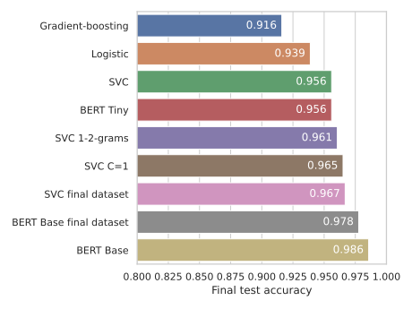

# Sentiment Analysis of Restaurant Reviews

This is assignment number 3 of the course DAT341 Applied Machine Learning at the [Chalmers University of Technology](https://www.chalmers.se). We were tasked to train classifiers on restaurant reviews labeling them as positive or negative.

This repository contains our code and the weights for the fine-tuned BERT model.

Details can be found in [the report](./report/report.pdf).

